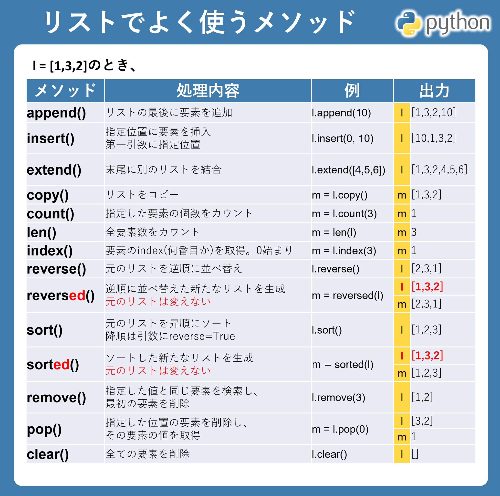
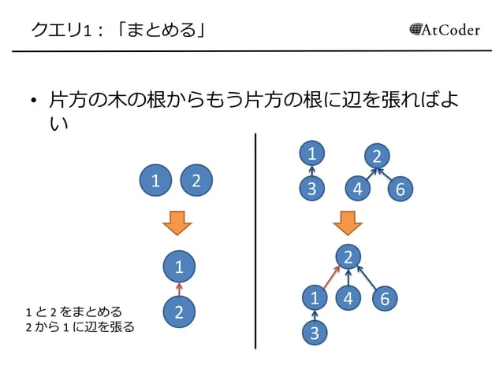
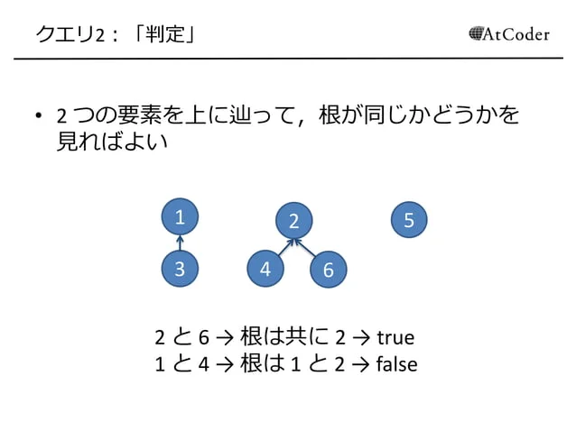
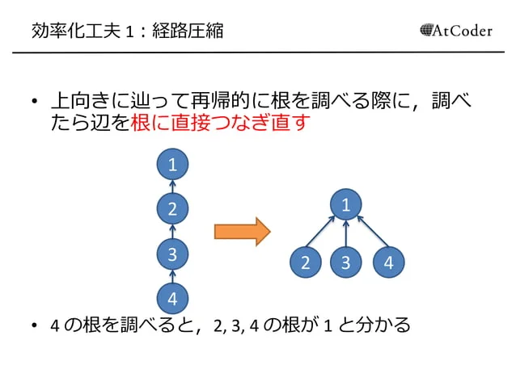

# AtCoderメモ
・[Quita](https://www.youtube.com/redirect?event=video_description&redir_token=QUFFLUhqbE1QY0l6Rk0xY0VIMTNrcGV3Y19ZeHg5SXJLUXxBQ3Jtc0tuTnYwelNOdlBKdnFkamNKX3RYMXdvQnM1OWlLNUNyWUV0N0pQNkNWTVFLTi0weEJ0ZEpFVW5NZDdXb2laTnBqYjVOdlktcjdTTi1BN1BwRC1JUHVYQmVjRzhxc3R4amk1eDFKSWZnbjF6NjJUV3lnbw&q=https%3A%2F%2Fqiita.com%2Fe869120%2Fitems%2Feb50fdaece12be418faa%232-3-%25E5%2588%2586%25E9%2587%258E%25E5%2588%25A5%25E5%2588%259D%25E4%25B8%25AD%25E7%25B4%259A%25E8%2580%2585%25E3%2581%258C%25E8%25A7%25A3%25E3%2581%258F%25E3%2581%25B9%25E3%2581%258D%25E9%2581%258E%25E5%258E%25BB%25E5%2595%258F%25E7%25B2%25BE%25E9%2581%25B8-100-%25E5%2595%258F&v=qxoQ6sKy3a)


## メソッド
###　文字変換
* upper(): すべての文字を大文字に変換
* lower(): すべての文字を小文字に変換
* capitalize(): 先頭の一文字を大文字、他を小文字に変換 
* title(): 単語の先頭の一文字を大文字、他を小文字に変換
* swapcase(): 大文字を小文字に、小文字を大文字に変換
* isupper(): すべての文字が大文字かどうか判定
* islower(): すべての文字が小文字かどうか判定
* istitle(): タイトルケースかどうか判定
  
###　リスト
* l.insert(index,val): indexにvalを追加
* l.extend(): 末尾にリスト追加
* l.copy(): コピー
* l.sort(),sorted(): 変換か、新たなリスト生成
* l.reverse(),reversed(): copyと同じ
* l.pop(index): indexの値削除し、値取得
* l.clear(): クリア

  

### set
* sorted set->簡単に言うと set の各要素が常にソートされているデータ構造だと思ってよい。
  以下がその例。
```python
  from sortedcontainers import SortedSet, SortedList, SortedDict
  S = SortedSet([3, 1, 2,6,7,8,9,10])
  #SortedSet([1, 2, 3]), 初期化の計算量は O(N * logN)
  S.add(4)
  print(S)
  #SortedSet([1, 2, 3, 4]), add の計算量は O(logN)
  S.add(3)
  print(S)
  #SortedSet([1, 2, 3, 4]), 要素は重複しない
  S.discard(4)
  print(S)
  #SortedSet([1, 2, 3]), 値4を削除 計算量は O(logN) 存在しない要素をdiscardすると、何も起こらない
  #S.remove(100) とやると、KeyErrorが出る
  S.pop(2)
  print(S)
  #S[2]を削除 S.pop()で最大要素の削除 S.pop(0) で最小要素の削除　全部 O(logN)
  print(S[1])

  #2 getは O(logN)
  print(S[0:2])
  #0 1 スライスなどもできる　これの計算量は長さを k として O(klogN)
  print(len(S))
  #2 現在の要素数 O(1)
  print(S.bisect_left(1))
  #1
  print(S.bisect_right(1))
  #2
  #これらは二分探索。 S.bisect_left(x) で、Sにxを挿入する位置(index)を返す。
  #S.bisect_right(x) との違いは、すでにxがSにあるときに左に入れるか右に入れるか
  #Pythonのbisectと同じ使用感
  print(S.index(2))

  #1 Sに2が現れる最初の位置を返す。ないとValueError
  print(S.irange(0,2))

  #[1, 2] S に含まれる 0以上2以下（両端含む）の要素を列挙
```
* sortedlist->ほとんどSortedSetと同じですが、重複した要素が許される。
* sortedDict->Dictの要素がソートされたバージョンです。

### 辞書型
[辞書型に関するURL](https://www.sejuku.net/blog/24122)
[defaultdictに関して](https://qiita.com/xza/items/72a1b07fcf64d1f4bdb7)

###　文字コード
* ord():文字から文字コード取得
* chr():文字コードから文字取得
  * ex.) a->97, A->65

###　入力
* [入力に関するURL](https://qiita.com/scythercas/items/5e08dfffb49468dd1176)

###　その他
* recerced(A): 逆順リストの新たな生成
* NEW_A = "".join(A)リストの各要素結合
* pow(a,N): aをN乗


## アルゴリズム
### 幅優先探索
各ノードに始点には0、他INFにセット。キューを使用して終点に行きつくまで繰り返し処理を行う。

* k回目の処理：キューから一つデキューしてそのノードについて調べる。現在のノードと隣接しているノードをキューに距離をkとし、プッシュ。プッシュされたノードは順に処理される

* 4方向の回転:directを0,1,2,3とし、右回転ならインクリメント、左回転ならデクリメントして4の剰余とる

### 二分探索: Left=0,Right=INF(最大値),MID=(R-L)//2とする。
  MIDに対して走査してそれより右にあるなら LをMIDに、左にあるならRをMIDとする。これを繰り返す。ただしソートされているのが前提

* ３つ足してKとなるa,b,c:a,b,cそれぞれにループさせたらオーダー大きいから、a,bループしてK-a-bがcに存在するか調べるとcのループしなくて済む

* ある配列の値をインデックスとした違う配列の値を更新:例えばある条件の下でP[i] <- P[B[i]]など。
  この時は[3,2,4,1,5]ならば3->4->1->3と2->5->2となり必ず閉じた有効グラフとなる。そのため有効グラフで考える


### 動的計画法(Dynamic Programing)
  全探索せずに小さな計算結果を保存し、冗長な計算を避ける。

  <動的計画法に関するURL>
    [初歩](https://www.momoyama-usagi.com/entry/info-algo-dp#i)
    [Quita](https://qiita.com/drken/items/dc53c683d6de8aeacf5a)
    [Quita:Dp問題の網羅](https://qiita.com/drken/items/a5e6fe22863b7992efdb#%E3%81%AF%E3%81%98%E3%82%81%E3%81%AB-----dp-%E3%81%AF%E5%BD%B9%E3%81%AB%E7%AB%8B%E3%81%A4)
    [Quita:Dp問題の網羅2](https://qiita.com/drken/items/a5e6fe22863b7992efdb#%E3%81%AF%E3%81%98%E3%82%81%E3%81%AB-----dp-%E3%81%AF%E5%BD%B9%E3%81%AB%E7%AB%8B%E3%81%A4)

#### 最適化、ナップサック問題、部分和問題 ect...
  例:Lこの数値をいくつか足し合わせてSになるものを探す。
    L行S+1列の配列に最大値を入れていく。
    オーダーはL(S+1)

#### ナップサック問題
    ナップサックへの許容量(制限が決まっている中で)最大の値を入れる組み合わせを考える。行がアイテム、列が最大許容量までの連続値とし、dp_tableを作成する。
    以下が実装例
  ```python
  def find_max_dp(num_list, limit): #行がリストの要素、列がSまでの数値
    list_len = len(num_list)
    dp_table = [[0 for j in range(limit + 1)] for i in range(list_len)]

    # 1番目
    for j in range(limit + 1):
        if num_list[0] <= j:
            dp_table[0][j] = list[0] # 1番目追加

    # 2番目以降
    for i in range(list_len):
        for j in range(limit + 1):
            tmp_not_choice = dp_table[i-1][j]
            if num_list[i] > j: # i番目の要素がjに到達しないときはi-1をそのまま採用
                dp_table[i][j] = tmp_not_choice 
            else: 
              #i-1行j列の値(i番目を不採用)とi-1行(j-i番目の値)列にi番目の値を足したもの(i番目を採用)をmaxで判定
                tmp_choice = dp_table[i-1][j - num_list[i]] + num_list[i]
                dp_table[i][j] = max(tmp_choice,tmp_not_choice)

    return dp_table[list_len - 1][limit]

  list = [4,8,6]
  print(find_max_dp(list,10))
  ```


#### 部分和問題
    ある列A_1,A_2,,,A_kをいくつか足し合わせてSになる組み合わせがあるか調べる
    行に列A、列にSまでの連続値とするdp_tableを作成する。以下が実装例

  ```python
    # A18 - Subset Sum
    #部分和問題SとなるならYes,ならないならNo

  N, S = map(int, input().split())
  A = list(map(int, input().split()))


  # 動的計画法（i=0）
  dp = [ [ None ] * (S + 1) for i in range(N + 1) ]
  dp[0][0] = True
  for i in range(1, S+1):
    dp[0][i] = False

  # 動的計画法（i=1）
  for i in range(1, N+1):
    for j in range(0,S+1):
      if j < A[i-1]:
        if dp[i-1][j] == True:
          dp[i][j] = True
        else:
          dp[i][j] = False

      if j >= A[i-1]:
        if dp[i-1][j] == True or dp[i-1][j-A[i-1]] == True:
          dp[i][j] = True
        else:
          dp[i][j] = False

  # 出力
  if dp[N][S] == True:
    print("Yes")
  else:
    print("No")
  ```
#### 最長共通部分列問題(LIS)
    1. 2つのシーケンスの長さを取得します。
    2. 動的計画法のテーブル（配列）を用意し、初期値を設定します。
    3. テーブルを更新していきます。
    4. 最終的な結果をテーブルから読み取り、最長共通部分列が得られます。
  ```python
  def longest_common_subsequence(text1, text2):
    m, n = len(text1), len(text2)
    dp = [[0] * (n + 1) for _ in range(m + 1)]
    
    for i in range(1, m + 1):
        for j in range(1, n + 1):
            if text1[i - 1] == text2[j - 1]:
                dp[i][j] = dp[i - 1][j - 1] + 1
            else:
                dp[i][j] = max(dp[i - 1][j], dp[i][j - 1])
    
    return dp[m][n]
  # 2つの文字列 "ACCGGTCGAGTGCGCGGAAGCCGGCCGAA" と "GTCGTTCGGAATGCCGTTGCTCTGTAAA" の最長共通部分列を求める例
  text1 = "ACCGGTCGAGTGCGCGGAAGCCGGCCGAA"
  text2 = "GTCGTTCGGAATGCCGTTGCTCTGTAAA"

  print(longest_common_subsequence(text1, text2))  # 結果: 20
  ```


#### 最長増加連続部分列問題
    配列があったとき、単調増加になっている、最も長い部分のこと。
    考え方
      1. 要素を前から一つずつ見ていく。
      2. 現在見ている要素が、一つ手前の要素以上であれば、増加列の長さを+1する。
      3. 現在見ている要素が、一つ手前の要素より小さければ、増加列の長さを1にリセットする。

  ``` python
  def longest_increasing_subsequence(nums):
  n = len(nums)
  dp = [1] * n
  
  for i in range(1, n):
      for j in range(i):
          if nums[i] > nums[j]:
              dp[i] = max(dp[i], dp[j] + 1)
  
  return max(dp)

  # 数列 [10, 9, 2, 5, 3, 7, 101, 18] の最長増加部分列を求める例
  nums = [10, 9, 2, 5, 3, 7, 101, 18]

  print(longest_increasing_subsequence(nums))  # 結果: 4
  ```

### 配列内要素iのインデックスを効率よく求める
  "配列Aの中でiがどこにあるか"を配列の中から毎回探すと、最悪Θ(N)時間、全体でΘ(N^2) 時間かかるケースが存在し、TLE(実行時間制限超過)となる。
  そこで配列Aの他に"Aの中で値iがある位置を表す配列pos"を用意し、同時に更新することにする。 
  例えばA=(3,1,2,4) のとき、pos=(2,3,1,4)となる。
  これによりΘ(1)で探索可能。
  ただしpythonでindex()を使うとこれは全探索してるのでΘ(N)となりうまくいかない。

  ```python
  A = [3,1,2,4]
  pos = [2,3,1,4]
  ```

### UnionFind
* Union: 2つの集合を1つに併合する
* Find: ある要素がどの集合に属しているかを判定する
[素集合データ構造](https://www.slideshare.net/chokudai/union-find-49066733)
[UnionFindについて](https://note.nkmk.me/python-union-find/)

はじめ素集合(すべて１つずつの集合)から併合していき、同じグループに属するものを見つける。リンクにもあるようにグループ作成時にΘ(N)かかってしまうので木を利用する

  
  
  

``` python  
#PythonでのUnion Findの実装例
from collections import defaultdict


class UnionFind():
  def __init__(self, n):
    self.n = n
    self.parents = [-1] * n

#要素x が属するグループの根を返す
  def find(self, x):
    if self.parents[x] < 0:
      return x
    else:
      self.parents[x] = self.find(self.parents[x])
      return self.parents[x]

  #xとyが属するグループの併合
  def union(self, x, y):
    x = self.find(x)
    y = self.find(y)

    if x == y:
      return

    if self.parents[x] > self.parents[y]:
      x, y = y, x

    self.parents[x] += self.parents[y]
    self.parents[y] = x

  #グループのサイズ返す
  def size(self, x):
      return -self.parents[self.find(x)]

  #xとyが同じグループに属するかどうか
  def same(self, x, y):
    return self.find(x) == self.find(y)

  #xが属するグループのリスト
  def members(self, x):
    root = self.find(x)
    return [i for i in range(self.n) if self.find(i) == root]

  #すべての根のリスト
  def roots(self):
    return [i for i, x in enumerate(self.parents) if x < 0]

  #グループ数
  def group_count(self):
    return len(self.roots())

  def all_group_members(self):
    group_members = defaultdict(list)
    for member in range(self.n):
      group_members[self.find(member)].append(member)
    return group_members

  #printでの表示用
  def __str__(self):
    return '\n'.join(f'{r}: {m}' for r, m in self.all_group_members().items())


#サンプル
#マイナスはその要素が根であり-2なら要素２の木。プラスならそのインデックスが親である
uf = UnionFind(6)
print(uf.parents)
# [-1, -1, -1, -1, -1, -1]

print(uf)
# 0: [0]
# 1: [1]
# 2: [2]
# 3: [3]
# 4: [4]
# 5: [5]

uf.union(0, 2)
print(uf.parents)
# [-2, -1, 0, -1, -1, -1]

print(uf)
# 0: [0, 2]
# 1: [1]
# 3: [3]
# 4: [4]
# 5: [5]

uf.union(1, 3)
print(uf.parents)
uf.union(4, 5)
print(uf.parents)
uf.union(1, 4)
print(uf.parents)
# [-2, -2, 0, 1, -1, -1]
# [-2, -2, 0, 1, -2, 4]
# [-2, -4, 0, 1, 1, 4]

print(uf)
# 0: [0, 2]
# 1: [1, 3, 4, 5]

#ここで__str__()が実行され経路圧縮が行われる
print(uf.parents)
#[-2,-4,0,1,1,1]
```